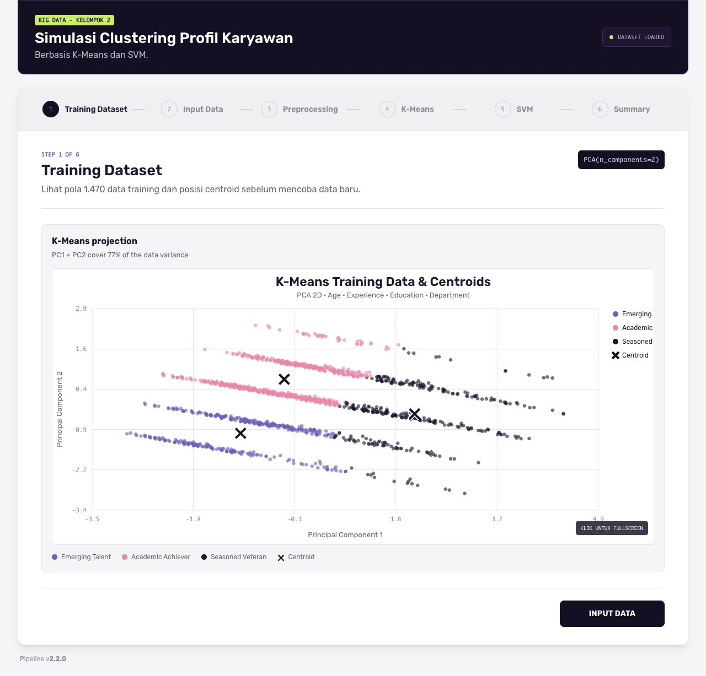
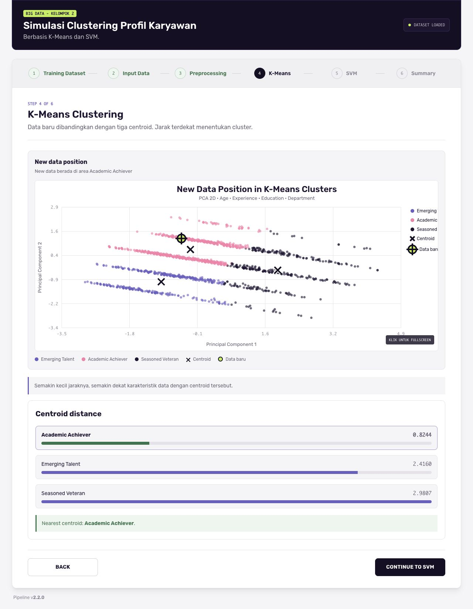
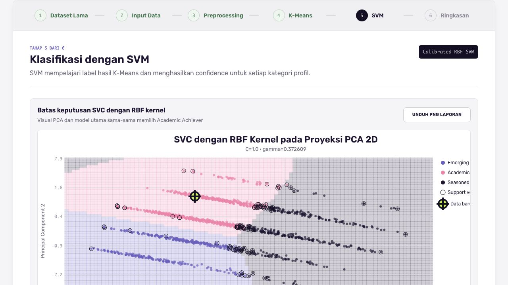

# Simulasi Clustering Profil Karyawan

Aplikasi desktop berbasis Python untuk menampilkan proses pengelompokan profil karyawan menggunakan **K-Means** dan **SVM dengan RBF kernel**.

Proyek ini dikembangkan untuk memenuhi tugas UAS mata kuliah Big Data. Proses analisis ditampilkan secara bertahap, mulai dari dataset pelatihan, preprocessing, K-Means, SVM, hingga ringkasan hasil.



## Gambaran Umum

Pengguna memasukkan empat atribut data karyawan:

- umur;
- total pengalaman kerja;
- tingkat pendidikan; dan
- departemen.

Data tersebut kemudian diproses melalui tahapan berikut:

1. **Preprocessing:** fitur numerik distandardisasi menggunakan `StandardScaler`, sedangkan departemen diubah menjadi fitur biner menggunakan `OneHotEncoder`.

2. **K-Means:** data dibandingkan dengan tiga centroid untuk menentukan cluster terdekat.

3. **SVM:** model SVM dengan RBF kernel mempelajari label hasil K-Means dan menghitung tingkat keyakinan untuk setiap kategori.

4. **Ringkasan:** hasil K-Means dan SVM ditampilkan bersama data masukan pengguna.

Tiga kategori cluster yang digunakan adalah:

- **Emerging Talent**
- **Academic Achiever**
- **Seasoned Veteran**

Penamaan tersebut digunakan untuk mempermudah interpretasi hasil cluster dan bukan merupakan penilaian terhadap performa karyawan.

## Visualisasi Proses

### K-Means

Plot K-Means menampilkan dataset pelatihan, posisi centroid, dan titik data baru.



### SVM

Plot SVM menampilkan batas keputusan (*decision boundary*) dari RBF kernel, *support vector*, dan posisi data baru.



## Menjalankan Aplikasi

Pastikan Python telah terpasang pada perangkat. Python 3.11 atau versi yang lebih baru disarankan.

### macOS / Linux

```bash
python3 -m venv .venv
source .venv/bin/activate
python -m pip install -r requirements.txt
python main.py
```

### Windows

```powershell
py -m venv .venv
.venv\Scripts\activate
python -m pip install -r requirements.txt
python main.py
```

Setelah perintah `python main.py` dijalankan, aplikasi akan terbuka dalam jendela desktop. Frontend dan browser tidak perlu dijalankan secara terpisah.

## Struktur Proyek

```text
project-big-data/
├── main.py
├── employee_app/
│   ├── api.py
│   ├── desktop.py
│   ├── core/
│   ├── models/
│   │   ├── kmeans.py
│   │   └── svm.py
│   └── ui/
├── data/
├── artifacts/
├── screenshots/
└── tests/
```

- `core/` berisi proses pemuatan data, preprocessing, pelatihan, dan alur prediksi.
- `models/kmeans.py` berisi implementasi proses K-Means.
- `models/svm.py` berisi proses pelatihan dan prediksi SVM.
- `ui/` berisi HTML, CSS, JavaScript, dan font aplikasi.
- `tests/` berisi pengujian otomatis untuk model dan API.

## Dataset

Proyek ini menggunakan dataset IBM HR Employee Attrition:

[HR-Employee-Attrition-All.csv](https://raw.githubusercontent.com/pplonski/datasets-for-start/master/employee_attrition/HR-Employee-Attrition-All.csv)

Dataset telah disimpan di dalam folder `data/` sehingga aplikasi dapat digunakan tanpa koneksi internet.

## Pengujian

```bash
python -m pytest
```

Model yang telah dilatih disimpan di dalam folder `artifacts/`. Apabila dataset atau versi pipeline berubah, model akan dilatih ulang secara otomatis.
